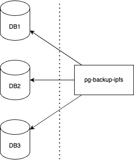
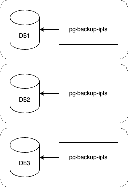

# ethglobal-paris-2023
Code from ETH Global Paris 2023 Hackathon

## Dependencies
```sh
brew list kind || brew install kind
brew list kubectl || brew install kubectl
brew list helm || brew install helm

# x86
brew list datawire/blackbird/telepresence || brew install datawire/blackbird/telepresence
# ARM64
brew list datawire/blackbird/telepresence-arm64 || brew install datawire/blackbird/telepresence-arm64
```

## Quick Start
For this example we will run the `pg-backup-ipfs` as a sidecar container for a Postgres database with "world data".

To start the cluster run `make dev-up`. This will create a `kind` cluster.
Then to deploy that database service together with the sidecar run `make db-update`.

## Architecture
The `pg-backup-ipfs` service can be run in multiple configurations.
Most of them will be one of the following.

### As an external service
You can run the `pg-backup-ipfs` as a standalone service that connects to multiple databases and backs them up.
This is a simple configuration.
<br/>


### As a sidecar
If you are running, for example, your Postgres databases in Kubernetes, chances are that you are already familiar with the sidecar pattern.
By running `pg-backup-ipfs` as a sidecar inside your Postgres `Pod` you can perform dumps in the same network space as the Postgres *container*.
Bellow is an illustration on how this configuration would work.
<br/>
